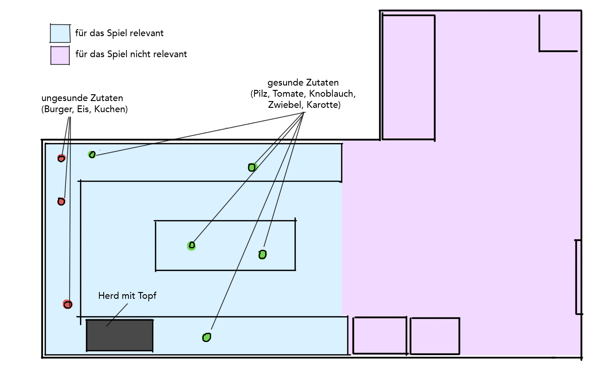
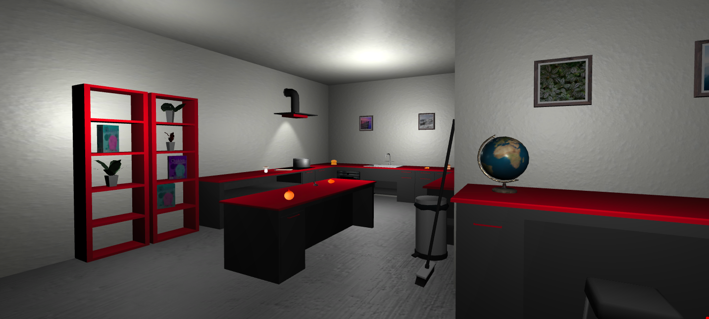
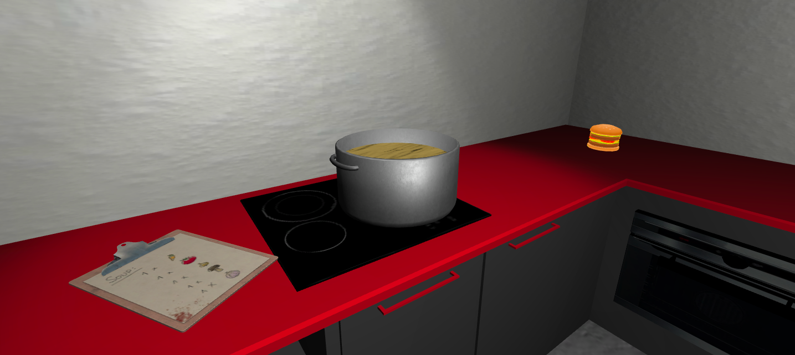

# VRProject-celpratter

### Project description: 
In this VR mini game, the player has to cook by following a recipe. Only the right ingredients lead to the perfect soup - so the player should avoid the false ones.
 
### Development platform: 
- OS: MacOS 10.14.3
- Unity Version: 2018.2.14f1
- Visual Studio Code Version: 1.33.0
- Scripting Runtime Version: .NET 3.5 Equivalen
- API Compatibility Level: .NET 4.0 Subs

### Visuals:

  

  

  

### Third party material: 
- Kitchen Creation Kit by Studio Krokidana (Unity Asset Store)
- Adorable 3D Food Set by Layer Lab (Unity Asset Store)
- Steam VR Plugin by Valve Corporation (Unity Asset Store)
- Food and Kitchen Props Pack by REACH THE END (Unity Asset Store)
- Clipboard by cookiepopworks.com (Unity Asset Store)
- Texture Maps Water_002 (3dtextures.me)
- Door Free Pack Aferar by Andrey Ferar (Unity Asset Store)
- Picture frames with photos by 3DFRK (Unity Asset Store)
- School Globe by Viverna (Unity Asset Store)
- Plants by Badri Bebua (Unity Asset Store)

### Project state: 
100%

### Limitations: 
None

### Lessons Learned: 
- changing colors of objects
- IEnumerator Coroutines, WaitForSeconds()

Copyright by celpratter
